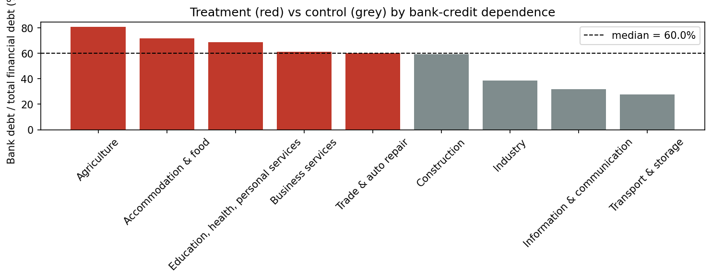
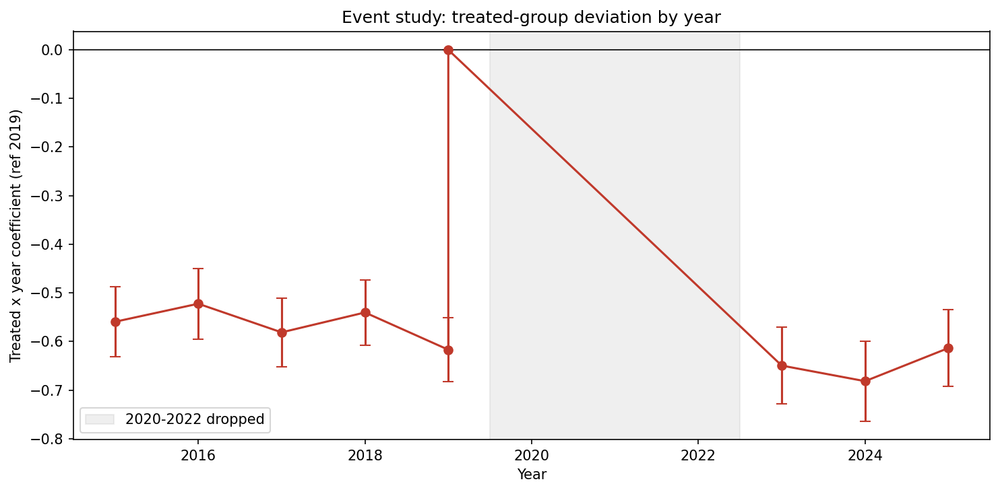
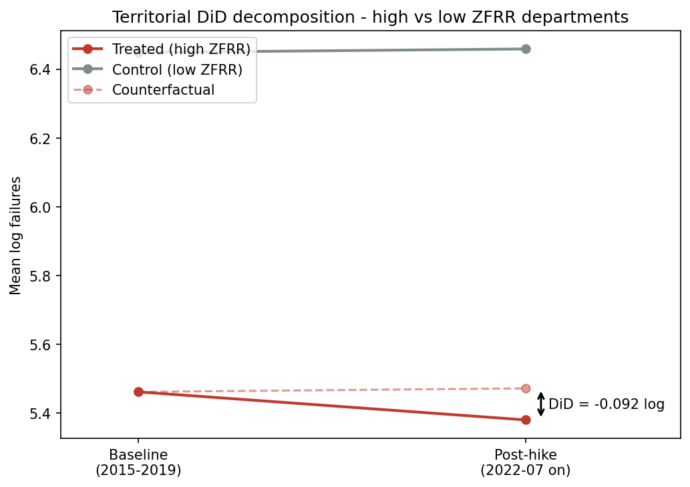

# ECB Rate Shock and SME Failures: A Causal Study of French Firms

A difference-in-differences study of whether the 2022 ECB rate hikes accelerated
failures among French SMEs in bank-credit-dependent sectors and in economically
fragile regions. Short answer: **no robust effect**. The headline estimates fade
once they are weighted by firm counts and checked against pre-trends.

[](https://www.kaggle.com/code/eternalia/ecb-rate-shock-and-sme-failures)

---

## Research question

> Did SMEs in sectors that rely heavily on bank credit experience a statistically
> significant acceleration in failures in the years following the first ECB rate
> hike (July 2022), relative to their 2015–2019 trend? And is this effect more
> pronounced in economically fragile regions?

---

## Study design

The outcome is the Banque de France 12-month rolling cumulative count of failures.
Sampled monthly it is heavily autocorrelated and its early post-hike values still
contain pre-hike months, so all regressions run on an **annual non-overlapping**
panel: each December = that calendar year's total. Baseline years are 2015–2019
and post years 2023 onward. 2020–2022 are dropped (COVID/PGE and the 2022
transition year). The first post observation (2023) covers months 6–18 after the
hike, the closest annual counterpart to an "18 months after" window, and
2024–2025 test persistence. Outcome `log(1 + failures)`, unit fixed effects,
SE clustered by unit.

---

## Sectoral findings (9 NAF sectors)

With only nine sectors, ordinary cluster-robust p-values are invalid, so inference
uses a **wild cluster restricted bootstrap** (Cameron-Gelbach-Miller).

| Estimate | Value |
|----------|-------|
| Bank-dependent vs others (median split) | −9.7% (wild-bootstrap p = 0.34) |
| Sharp split (top-3 vs bottom-3 dependence) | −16.6% (p = 0.28) |
| Placebo (fake 2018 break in the baseline) | −0.3% (p = 0.96) |

The point estimates are negative (bank-dependent sectors did **not** fail more, if
anything less) but **none is statistically significant**. The placebo test, which
pretends the shock happened in 2018, finds nothing, as it should. With nine sectors
this analysis carries little statistical power on its own.



*Sectors split at the median bank-debt share: treated (red) vs control (grey).*

---

## Territorial findings (≈100 departments)

A separate department-level DiD (failures exist by sector nationally *or* by
department for all firms, never crossed). Departments are split at the median share
of communes classified ZFRR.

| Estimate | Value |
|----------|-------|
| High vs low ZFRR (median split) | **−8.1%** (p = 0.034) |
| Continuous ZFRR intensity (per +1 SD) | −6.4% (p = 0.007) |
| Weighted by firm stock (effect on the average *firm*) | −2.3% (p = 0.53, ns) |
| Broad FRR definition (codes 1–5) | −8.8% (p = 0.021) |
| Metropolitan departments only (drop overseas) | −4.2% (p = 0.10, ns) |
| Placebo (fake 2018 break) | −2.4% (p = 0.31, ns) |

The simple DiD is negative and significant: high-ZFRR (rural/fragile) departments
saw a *smaller* post-2022 rise in failures, the opposite of the equity concern.
**But the effect is not robust.** It loses significance when departments are
weighted by their firm stock (the average *firm* rather than the average
*department*) and when overseas departments are dropped. And in the event-study
specification, which absorbs year effects, the post-hike coefficients are close
to zero and not significant.

Overall, there is **no robust evidence** that the rate shock disproportionately
raised SME failures in bank-dependent sectors or fragile territories. The one
significant headline is concentrated in small and overseas departments and fades
under firm-weighting and year effects.



*Treated-group deviation by year (ref 2019). 2015–2018 roughly flat, 2020–2022 dropped.*



*Baseline vs post-hike mean log failures, high- vs low-ZFRR departments, with the DiD gap.*

---

## Operational definitions

The three terms in the question (*SME*, *bank-credit-dependent sector*, *fragile
region*) are defined and constructed in the study, not assumed.

### SME

Fewer than 250 employees, per the *Loi de modernisation de l'économie* of 4 August 2008
(decree n°2008-1354). This is the threshold the Banque de France and INSEE use in their
failure statistics, so it sets the granularity of the analysis.

### Bank-credit-dependent sectors

No official list exists. Each NAF sector is ranked by the **share of bank debt in total
financial debt** (the FIBEN ratio *part des dettes bancaires*, bank vs bond vs leasing),
averaged over 2018–2021. Bank debt is the channel through which ECB rate hikes reach firms:
bank lending rates reprice, whereas bonds are fixed at issuance and leasing is contractual.

The maturity split (short- vs long-term credit) is not available by sector in open Banque
de France data, which reports debt by instrument rather than by maturity, so bank-debt
share is the available proxy for exposure to the bank-lending-rate channel.

### Economically fragile regions

Municipalities classified *Zone France Ruralités Revitalisation* (ZFRR) under the 2024
budget law (article 73, in force since 1 July 2024), which replaced the former ZRR, BER
and ZORCOMIR. Treatment intensity per department = share of its communes classified FRR
socle or + (Observatoire des Territoires codes 4–5).

---

## Method

- **Treatment date:** July 2022, the first ECB policy-rate hike.
- **Sample:** annual non-overlapping (December totals). Baseline 2015–2019, post 2023+, 2020–2022 dropped.
- **Outcome:** `log(1 + annual failures)` with unit fixed effects.
- **Inference:** SE clustered by unit. For the 9-sector analysis, a wild cluster restricted bootstrap (valid with few clusters).
- **Robustness:** sharp treatment contrast, continuous intensity, firm-stock weighting, broad FRR definition, metropolitan-only, an event study for pre-trends, and a baseline placebo.

### Separating the rate effect from the COVID/PGE rebound

State-guaranteed loans (*Prêts Garantis par l'État*, 2020–2021) suppressed failures during
the pandemic and produced a rebound that overlaps the rate effect. The annual design drops
2020–2022 entirely, so neither the suppressed years nor the rebound ramp enters the panel,
and the December sampling keeps every retained post observation fully after the hike.

### Definition of failure

A failure (*défaillance*) is the opening of a *redressement* or *liquidation judiciaire*
following a declaration of cessation of payments (Banque de France / INSEE). Voluntary
closures, deregistrations and disposals are excluded.

---

## Project structure

```
├── notebooks/
│   ├── 01_exploration.ipynb    # Sector debt structure, failures, ZFRR, rates
│   ├── 02_cleaning.ipynb       # Treatment split, annual panel construction
│   ├── 03_analysis.ipynb       # Sectoral DiD + wild cluster bootstrap
│   ├── 04_territorial.ipynb    # Department DiD, event study, robustness
│   └── 05_sql.ipynb            # The preparation redone in SQL (DuckDB)
├── sql/                        # Documented queries run by notebook 05
├── src/
│   ├── data_loader.py          # Loading functions for all datasets
│   └── cleaning.py             # Treatment, annual panel, wild cluster bootstrap
├── data/
│   ├── raw/                    # Source files (download, see below)
│   └── processed/              # Annual panels exported by the notebooks
├── outputs/                    # Generated figures
├── requirements.txt
└── README.md
```

---

## Data sources

| Dataset | Source | Use |
|---------|--------|-----|
| Sector debt structure (FIBEN balance-sheet ratios), annual | [Banque de France (Webstat)](https://webstat.banque-france.fr/) | Bank-credit-dependence (treatment) |
| Business failures by sector & size and by department, monthly | [Banque de France (Webstat)](https://webstat.banque-france.fr/) | Dependent variable |
| ECB policy-rate history | [FRED](https://fred.stlouisfed.org/) (ECB series) | Treatment date (July 2022) |
| FRR commune classification | [Observatoire des Territoires](https://www.observatoire-des-territoires.gouv.fr/) | Territorial fragility |
| Establishments by commune (FLORES) | [INSEE](https://www.insee.fr/) | Firm-stock weight / failure rate |

All sources are open (French *Licence Ouverte* / public statistics).

---

## How to run

```bash
python -m venv ecb-env
ecb-env\Scripts\activate            # Windows  (source ecb-env/bin/activate on macOS/Linux)
pip install -r requirements.txt
jupyter notebook
```

Raw data is committed in the repo (all sources are open data), with one exception:
INSEE FLORES (219 MB, above GitHub's per-file limit). To reproduce the firm-stock
weighting and failure-rate figure in notebook 04, download *FLORES 2024, nombre
d'établissements et effectifs salariés en 38 grands secteurs* (communal CSV) from
[insee.fr](https://www.insee.fr/) and unzip it to
`data/raw/sirene/DS_FLORES_A38_2024_CSV_FR/`. Everything else runs from a fresh clone.

Run the notebooks in order: `01` → `02` → `03` → `04`. Notebook 02 writes the
annual panels to `data/processed/`. Notebooks 03 and 04 read them and produce
the figures. Notebook `05` replays the main preparation and summary steps in
SQL (DuckDB) from the queries in `sql/`, and its raw 2x2 estimate matches the
regression coefficient of notebook 03 to the fourth decimal.

---

## Limitations

1. **PGE / COVID rebound:** the dominant confounder. Handled by dropping 2020–2022 and by the annual December sampling, so retained post observations lie fully after the hike.
2. **Few sectors:** nine NAF sectors only. Even with the wild cluster bootstrap the sectoral test has low power (9 clusters allow just 2⁹ = 512 distinct sign vectors, so the bootstrap p-value is itself coarse).
3. **Treatment proxy:** bank-debt share stands in for rate exposure (the maturity split is unavailable by sector in open data). Industry and personal services aggregate two FIBEN sub-sectors with a simple mean.
4. **Territorial granularity:** department failures are all-firms (no PME breakdown at that level, and SMEs are ~99% of firms) and ZFRR intensity is unweighted by population.
5. **Pre-trends hold only approximately:** the event-study coefficients for 2015–2018 sit between +0.04 and +0.10 log relative to 2019, with one year borderline significant. Nothing dramatic, but not perfectly flat either. Combined with the loss of significance under firm-weighting and in the metropolitan-only specification, the evidence does not support a causal claim. The conclusion is a null result.
6. **Firm stock:** FLORES is a 2024 snapshot used as a fixed weight/denominator.
7. **Reproducibility:** raw data and processed panels are committed. Everything runs from a fresh clone except the FLORES-based cells of notebook 04 (one manual download, see *How to run*).

---

## Stack

Python · pandas · NumPy · statsmodels · SQL (DuckDB) · matplotlib · Jupyter
